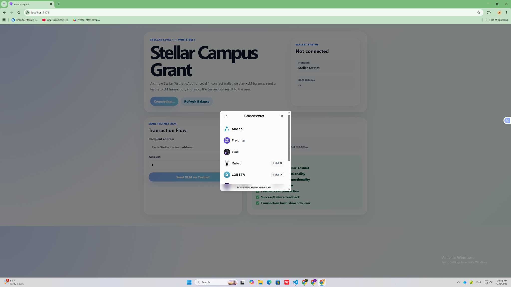
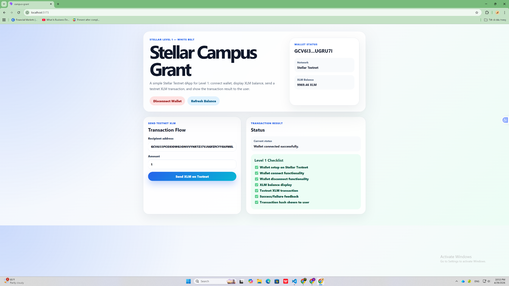
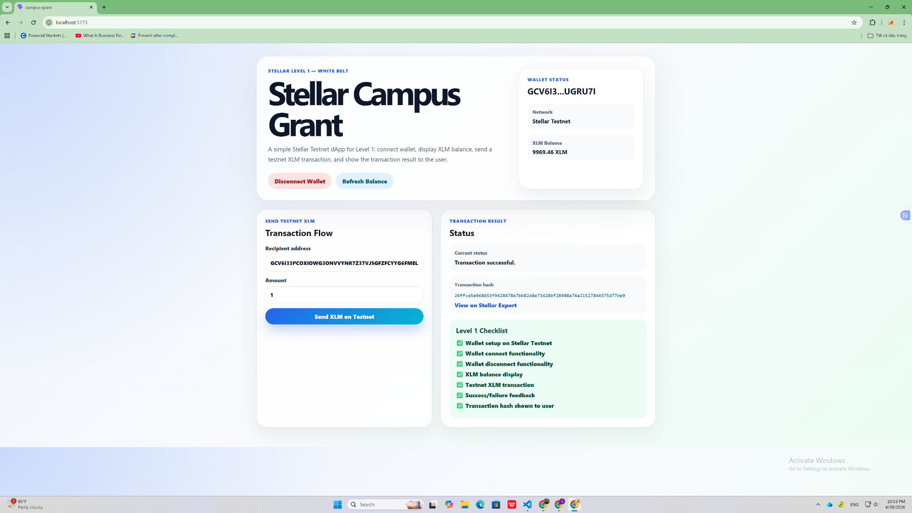

# Stellar Campus Grant

Stellar Campus Grant is a simple Stellar Testnet dApp built for **Level 1 — White Belt**.

The project demonstrates the core Stellar fundamentals:

- Connect a Stellar wallet using Stellar Wallets Kit
- Display the connected wallet address
- Fetch and display the wallet XLM balance on Stellar Testnet
- Send an XLM transaction on Stellar Testnet
- Show transaction feedback, including success status and transaction hash

---

## Features

### Wallet Connection

The app allows users to connect their Stellar wallet through the **Stellar Wallets Kit modal**.

Supported wallet flow:

- Open wallet selection modal
- Select Freighter wallet
- Connect wallet
- Display connected wallet address

### Balance Display

After the wallet is connected, the app fetches and displays the wallet's XLM balance from Stellar Testnet.

### Testnet XLM Transaction

Users can send XLM on Stellar Testnet by entering:

- Recipient Stellar address
- Amount of XLM

After the transaction is submitted, the app displays:

- Transaction success/failure status
- Transaction hash
- Stellar Expert transaction link

---

## Tech Stack

- React
- Vite
- Stellar SDK
- Stellar Wallets Kit
- Stellar Testnet
- Freighter Wallet

---

## Project Structure

```text
Stellar-Campus-Grant/
├── public/
├── screenshots/
│   ├── wallet-kit-modal.png
│   ├── wallet-connected-balance.png
│   └── transaction-success-hash.png
├── src/
│   ├── App.jsx
│   ├── App.css
│   └── main.jsx
├── package.json
└── README.md
```

---

## Screenshots

### 1. Stellar Wallets Kit Modal

This screenshot shows the wallet connection modal powered by Stellar Wallets Kit.



---

### 2. Wallet Connected and Balance Displayed

This screenshot shows the connected wallet address and XLM balance on Stellar Testnet.



---

### 3. Successful Testnet Transaction

This screenshot shows a successful XLM transaction, including the transaction hash and Stellar Expert link.

